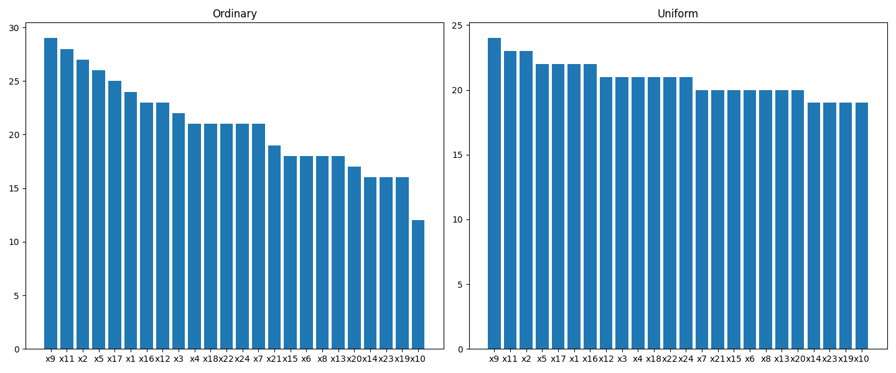

# artifical intelignece-experiment 5

The question is about random forest. Subsampling features in random way can lead to under representing crucial features.

So idea is to create simple algorithm that subsamples features in much more uniform way:
- no features are under represented
- decision trees in random forest are more diverse by avoiding similarity because of over representation and under representation of some features

## Results:

Yes, there can be created simple algorithm to create subsamples with uniform distribution of features.

More datails: 

## Question:
After fixing obvious bug that made Random Subspace invalid results are counterintuitve. They make no sense. Random bias is improving predictions. Why... is it something in how I adjust for bias that makes generation of predictors less diverse?
